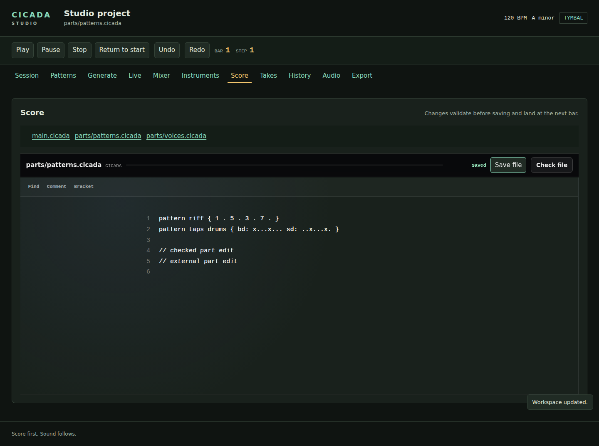

# Cicada Studio

Studio is a GoSX workstation for projects on disk. The Windows app starts
without a score by creating an untitled project in Documents\Cicada; **File → New**
creates another project. Explicit `cicada.mod` projects can contain several
score files. Its editor, forms, navigation, meters, and live performance use
GoSX; Tymbal handles native audio devices.
Changes to patterns, mixer settings, and arrangements write back to the score.

From a source checkout, build both executables and open a score:

```sh
make build
./build/cicada studio examples/first-acid.cicada
```

Open the printed loopback URL. Playback starts only when you select **Play**.
`--audio null` exercises transport without an output device. On Windows and
Linux, the default is Tymbal. Use **Audio** to select its devices and input
monitoring settings while stopped.


## Transport and session

**Play**, **Pause**, **Stop**, and **Return to start** control native playback.
The bar, step, backend, and errors update through GoSX live bindings. Valid
score edits become active at the next bar; an invalid external edit leaves the
last valid score playing.

**Session** shows a scene-by-track matrix. Select a scene header to launch its
assignments, a pattern cell to queue one track, or **Stop** to stop a track.
Launches are quantized to the next bar. **Keep** preserves that track's slot.

The arrangement timeline shows scene blocks across all tracks, their bar
ranges, and inherited patterns. Click a scene header to play from that block,
or a pattern clip to open its editor. Expand a block to replace its scene,
set its length, duplicate it, remove it, or move it earlier or later.
**Add to arrangement** appends an existing scene. At least one block remains.
Structural changes to songs with intervening comments require a Score edit
so those comments keep their attachment. Local scene and bar edits preserve them.

**Project settings** changes the title, tempo, key, and scale. Tempo keeps up
to three decimal places. Changing the key retunes scale-degree notes; explicit
letter pitches keep their pitch. Every edit validates and checks the current
disk revision before saving, and has an Undo entry.


**Scene automation** shows parameter lanes alongside the song's scene blocks.
Choose a parameter and **Inspect parameter**, then choose a scene and **Add or
replace point**. Track level and pan, sends, supported synth controls, and
effect parameters use the shared parameter catalog. Values accept their units
(for example `1.25kHz`, `250ms`, or `-6.25dB`), and controls report the allowed
range and alternatives. Existing points can be edited or removed.

A point applies each time its scene starts, with the engine's parameter
smoothing. **●** marks an explicit point; **↳** carries the previous value.
Removing a point keeps that inherited value; add the score's default value
explicitly to reset it. Repeated uses of a scene share its points. Playback,
seek reconstruction, WAV exports, and stems use the same scene settings.
Edits preserve surrounding source comments and support Undo. These lanes
place points at scene boundaries. Continuous curves and recording control movement are not supported.




## Patterns

Choose a pattern from the library. The piano roll shows pitched patterns;
drum patterns show their authored lanes.

With browser scripting on, the **Piano-roll tools** start on **Select**. Click
a cell to inspect its step without changing it, or double-click an empty cell
to add a note or hit. Choose **Draw (B)** and a click writes or erases a cell.
Press **B** to switch between the two tools. With a cell focused, **Delete** or
**Backspace** clears its step, and the left and right arrow keys select the
neighboring step. In a notes pattern, with the selected note's cell focused, the
up and down arrows transpose it by a semitone; hold **Shift** for an octave.
Without browser scripting there are no tools: a click on a cell writes or
clears it. In either mode, choose a step number (starting at **1**) to inspect
that step without changing it.

**View register** moves the piano roll to another octave; the editor reports
notes outside the displayed register.

The step inspector sets note, tie, or rest; MIDI pitch; accent and slide;
ratchet from 1–8; and chance from 1–100%. Drum hits offer velocity levels
**1–9**, normal **x** (100), or accented **X** (127). Melodic dynamics use the
voice's accent behavior. **Pattern timing** edits swing, gate, and transpose,
and resizes patterns to 1–64 steps. Shortening removes the ending steps from
every lane; Undo restores them.

**Range editing** copies, clears, reverses, rotates, or transposes selected
steps. Copy writes at its destination without extending the pattern; overlapping
copies read the original range. Rotate wraps inside the selection. Transpose
changes note pitches while retaining articulation, rests, and ties. Drum lanes
support the first four operations. Each operation commits as one Undo entry.

**Create variation** duplicates a pattern with independent notes and no reserved
slot. Its current pitches are written explicitly, including a custom voice's
home octave. **Assign to scene** places it on a compatible track. Editing a
phrase-based pattern expands its phrase uses locally, preserving the shared
phrase and other patterns. Comments inside a phrase-use expression require a
Score edit instead of being discarded.


## Phrase generation

**Generate** creates deterministic acid phrases from a 64-bit seed, key,
scale, structure, density, articulation, swing, and gate. Eight scales and
8, 16, 32, or 64 steps are available. Seeds remain exact even above JavaScript's
integer precision limit.

**Preview phrase** leaves the open score unchanged. The preview belongs to
your browser session and expires after thirty minutes. Open **Mutate or evolve
the first bar** to select an operation or generation index. Check the steps
that must remain locked. A variation preserves those steps and the preview's
other patterns and arrangement. If an operation requires changing a lock,
Studio reports the conflict.

**Replace open score with this phrase** applies the complete reviewed preview.
It checks the original revision; it cannot overwrite another editor's save.
**Undo** restores the previous score.

## Live performance


**Live** plays the **Pitched track** you choose from the A/W/S/E/D/F/T/G/Y/H/U/J/K
keys or the onscreen keyboard. That list offers acid tracks, the modeled
keyboards, and authored instrument tracks; audio and sampler tracks are not
offered. The drum pads play the **Drum track** you choose and use General MIDI
notes. Press **Play** first; changing tracks, leaving the panel, or losing focus
releases held notes, and **Release notes** releases them on demand.
The launch matrix queues scenes or individual slots with the selected timing;
mint marks a playing slot and amber marks a queued slot. Its forms also work
without browser scripting.

**Enable MIDI** asks for browser permission without system-exclusive access.
Live then reads Note On, Note Off, and Control Change messages from each
connected input. Notes play the selected pitched track. On channel 10, General
MIDI drum notes play the selected drum track and other notes are ignored. Live
ignores every other message, including pitch bend, channel and polyphonic
pressure, and MPE zone setup, so an MPE controller plays plain notes without
per-note expression. Web MIDI supplies MIDI 1 packets; this input does not
decode MIDI 2 Universal MIDI Packets.

#### Record and Arm

Select a parameter, scene, slot, track stop, or transport target, then **Learn
next input**. Parameters learn controller messages; launches learn note
messages. **MIDI launch timing** chooses next beat, next bar, or one, two, or four
bars. Mapping and track selections are saved in this browser. **Clear mappings**
removes them. Browsers without Web MIDI can still use keyboard and drum pads.

Press **Play**, choose the **Pitched pattern** and **Drum pattern** to record
into, then select **Record notes**. Acid and drum recordings use separate
pattern targets. **Finish note take** retains the notes for review without
changing the score. Under **Retained note take**, **Commit notes to patterns**
quantizes the notes to the nearest step and **Discard note take** drops them;
after a commit, **Undo** restores the previous patterns. While you record, the
take stays in the page, and an interrupted take is retained in the tab's session
storage when available. If the score changes after you finish, the preview
stays and a message asks you to review the notes against the current patterns
before you choose **Apply notes to current score**. Server previews expire
after thirty minutes or when Studio closes.
Take commits support acid, drum, and eight-voice programmable tracks with
single-note takes. Existing chord patterns are refused without changing the
score; edit their chords in the grid or source pane. Chord recording is not
available through the take editor. An acid take turns a note that is still held
when the next one starts into a slide.

The Live panel records each note's pitch, timing, and velocity. It does not
record bend, vibrato, pressure, or timbre. To add expression, write `bend:`,
`vibrato:`, `pressure:`, and `timbre:` rows in **Score**; see [expression
rows](../spec/features.md#expression-rows).

## Mixer and instruments

**Mixer** edits track, bus, return, effect, and master fields supported by the
source patcher. Each **Set** writes one parameter. Unsupported fields explain
their limitation and remain available in **Score**.
Ranges, units, enum choices, and On/Off controls come from Cicada's parameter
registry. Existing track sends are included in their mixer strip.
For an edition 1 score, first check **Upgrade score to edition 2 for this change**.
The domain service performs the migration and parameter edit together.
#### PCM capture and shared sampler audition

For tap slicing, velocity layers and round robins, use **Record your own
instrument** in the Record panel. See [recording instruments](recording-instruments.md)
for microphone, WAV import and offline pack commands.

Add an edition-2 audio track and a scene, stop transport, and open **Record**.
Choose the target **Audio track** and **Scene** before arming. Synth tracks
provide accompaniment during recording; recorded clips are auditioned separately.
The GoSX meter surface shows track and master peaks, RMS, momentary,
short-term and integrated LUFS, loudness range, true peak, and dropped blocks.
**Reset live loudness** begins a new measurement. The surface stops polling
when you leave the mixer. Offline export still provides the final loudness
verification.

**Instruments** offers six starting patches: Warm pad, Wide strings, Poly brass,
Silk pluck, Round bass, and Soft bell. **Add instrument and track** saves an
editable graph and its track in one Undo step. Five patches have eight-note
polyphony; Round bass is monophonic. Choose the new track in **Live** to play
it using the on-screen keyboard, typing keyboard, or MIDI. Bind a notes pattern
in **Session** to sequence it and include it in WAV exports.

Declared parameters show their default and current track override. Apply a
value to shape just that track; **Use default** removes its override. Values
use the parameter's declared unit. Each change is revision checked and can be
undone. Edit the complete graph in **Score**. Notes patterns and committed note
takes currently store one pitch per step; overlapping polyphonic takes explain
this limit instead of discarding chord notes.

## Score and history

**Score** uses the GoSX code editor with syntax highlighting, a gutter, and
two-space indentation. **Score** lists the project files. Select a file, edit it, then use **Check file**
to review its diagnostics or **Save file** to validate and write that file. Other
score files retain their exact bytes. External changes refresh clean editors and
project views; unsaved drafts remain available for an explicit merge. Saved
revision files live in app data, with late writes from other editors retained. A rejected edit
keeps the file unchanged and retains the draft across reload and navigation.
Rejected drafts expire after thirty minutes or when Studio closes.

The file remains authoritative. If another editor saves first, Studio reports
a conflict and retains your draft. Reload **Score** to see the current file
beside it, combine the changes in the editor, and select **Save combined draft**.
Another save in the meantime causes a new conflict. **Discard draft** restores
the file without writing to it.

**History** shows source diffs and transport events. **Restore this revision**
restores a selected edit. **Undo** and **Redo** are available in the toolbar.
History changes also check the disk revision.

## Audio, takes, and export

**Audio** selects input and output devices, input enablement, monitoring mute,
gain, and stereo or mono channel selection. Stop playback before applying these
settings. Device errors stay visible; Cicada does not silently switch engines.

**Takes** selects an audio track and scene for native input recording. Enable input in
**Audio**, then **Arm take**, **Record**, and **Finish take**. Recording begins
after a one-bar count-in; status shows saved frames or seconds and incomplete
input. The durable journal
retains failed or conflicting takes. **Select take** commits a selected take;
**Recover take** retries its recovery against the current revision.

Use **Add audio track** to create a recording lane in an edition-2 score. An
edition-1 score uses the explicit upgrade option in Mixer first. The Audio
tracks and clips section edits the source-frame start, exclusive end, gain, and
linear fades of each recorded region. **Place clip in scene** assigns it to an
audio track without modifying the recorded file. Region and assignment edits
check the source revision and support Undo. Arrangement audio blocks link here.


**Audition sample** opens a private preview of a published take. Choose its
root and playback MIDI notes and optional full-region looping, then **Update
audition** and use the audio controls. The native sample voice renders the WAV;
audition leaves the score unchanged and stops when you leave the panel.

Audio clips and declared sampler instruments play through the native mixer,
effects, meters, and Tymbal output, and are included in WAV and stems exports.
An explicit clip assignment starts its region when the scene is launched or a
song entry begins; `keep` continues it, and `off` releases it. A multi-bar entry
does not retrigger the clip each bar. Pause retains the source position, and
playing from a later block reconstructs an inherited clip's elapsed position.
Clips play once at their source rate; they are not stretched to fit scene bars.
Sampler patterns use the declared root pitch, voice budget, and oneshot or loop
mode; note gates release their voices. Supported playback ratios are 0.125–8.
**Live** does not offer sampler tracks; see [Live performance](#live-performance).

Assets are verified and decoded before playback, confined to the project
directory, and shared immutably between regions. Native playback admits up to
64 MiB of resident PCM per prepared project and 16 clips per audio track. File
I/O and decoding never run in the audio callback. While a new native take
records, existing audio clips and sampler tracks are silent and synth tracks
play as accompaniment. The portable AudioWorklet image uses the same sample-capable engine and
verified pack map as native playback and offline render. The existing 2 MiB
project-image and 64 MiB native resident-PCM limits still apply.

### Library

The Library panel lists public instruments, kits, FX chains and presets from
standard, project and user libraries. Filter by kind or search by name and
library path. Select a track, or enter a new track name, then choose **Insert**.
Studio adds the import once and updates the library pins before committing the
validated source. Drive binds as an insert, delay and reverb bind as sends, and
compression binds on the music bus. Unsupported combinations leave the score
unchanged.

**Preview** plays a fixed one-bar phrase at 120 BPM through the selected audio
engine without changing the score. Only one preview plays at a time; starting
transport or switching audio mode stops it. Stop playback and recording before
previewing. Browser previews use the same kernel and AudioWorklet processor as
score playback.

To save a selected track's stored values, enter a preset name and choose
**Save as preset**. Studio resolves any existing preset and writes the current
non-default registry values into a new declaration in the score. Source edits
and preset saves support History undo and redo. Pins remain available for redo.
Studio continues to refuse multi-file source editing.

### History

**Export** renders WAV with a target LUFS value, true-peak ceiling, tolerance,
sample rate, and PCM depth. Progress, measured LUFS, true peak, applied gain,
limiter reduction, and the output path update through GoSX. **Download WAV**
appears when the current job completes. A shortfall render is labeled explicitly
for inspection before delivery. Rendering checks the displayed source revision;
starting another job invalidates its previous download link. Audio stays outside
the public asset bundle, and long downloads stream through the private service.
Offline rendering uses the same Cicada kernel as Tymbal playback. See
[exporting](exporting.md) for stems, MIDI, and verification commands.

## Browser support

Forms, editing, navigation, and transport commands also work with JavaScript
disabled. Live bindings, editor enhancements, MIDI, note input, and meters require the
GoSX browser runtime. The audio service continues to run natively.

## Safe editing

Studio edits the same `.cicada` source you can open in a text editor. It
validates a proposed change before writing, checks that the file revision has
not changed, and refuses writes when it detects an unresolved external
recovery file. If Studio reports a conflict, read the message, compare the
named recovery file with your current score, and resolve the edits before
continuing.

If you want Studio beside VS Code, install or run the extension described in
[Editors and notation tools](editors.md#vs-code).

Continuous automation appears below the Song lane. Each graph labels its parameter, range and musical endpoints; point descriptions retain positions, values and shapes for assistive technology. Edit `automate` blocks in the score and reload to update the curves. See [automation blocks](../spec/features.md#automation-blocks) and [the runnable example](../../examples/continuous-automation.cicada).

Input recording uses the native device selected in **Audio**. The current
Tymbal backend does not run in a browser AudioWorklet; native playback and
capture are independent of browser microphone permission. Legacy portable-host
adapters remain qualification fixtures and are excluded from Studio's
production routes.
