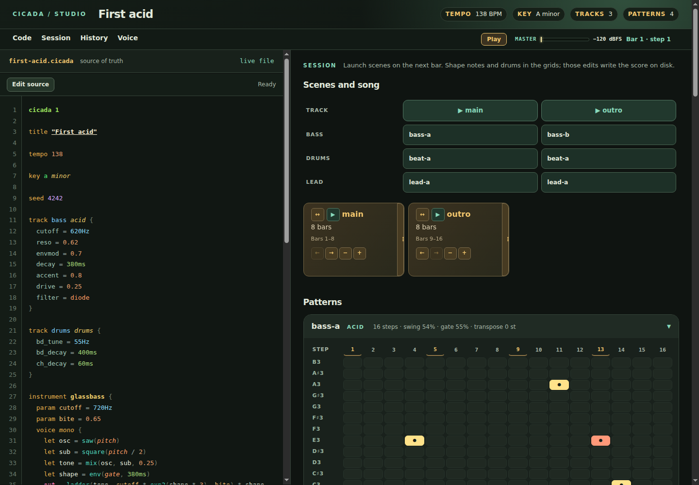
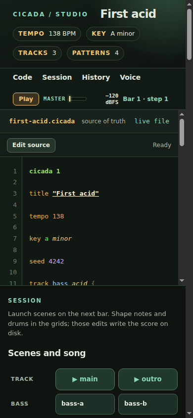

# Cicada Studio

Studio shows your source and the project it compiles into. When you change a
pitch, drum hit, or song block in the grid, Studio writes that change back to
the score file.

Open a score from the repository root:

```sh
./cicada studio examples/first-acid.cicada
```

Studio prints a loopback URL. Open it in your browser. The transport starts
stopped; the page does not play sound until you select **Play**.





## The Studio page

The top bar shows the score title, tempo, key, track count, and pattern count.
The navigation links jump to **Code**, **Session**, **History**, and **Voice**.
The transport button and its bar-and-step position sit beside the navigation.

### Code: the source pane

The left pane names the score file and marks it as the source of truth. Select
**Edit source** to open the text editor. **Save score** validates and compiles
the source before writing it; a rejected edit leaves the file unchanged.
**Discard** restores the last saved text. The status line reports validation,
save, and conflict results.

The file on disk remains authoritative. If another editor saves first, Studio
rejects its stale revision so you can reload and combine the changes.

### Session: scenes and pattern grids

The scene matrix has one column per scene and one row per track. A scene header
launches all of its assignments. A pattern cell queues that pattern on one
track. These launches take effect at the next bar while the transport runs.
Cells marked **keep** or **stop** describe the scene but are not launch buttons.

Open a pattern card to see its step grid:

- In a pitched pattern, click a pitch-row cell to set that step to the row's
  note. Click the active pitch again to clear it. The **Note** row toggles a
  note and a rest; the **Velocity** row displays the compiled velocity.
- **Accent** and **Slide** toggle their modifiers on an existing note.
- **Ratchet** cycles through one to eight hits.
- **Chance** cycles through 100%, 75%, 50%, and 25%.
- In a drum pattern, click a lane cell to switch between silence and a normal
  hit. Edit drum velocity and modifiers in the source pane.

Each successful grid edit changes the source file and refreshes the
projection. If the step came from a reused phrase, the edit changes the phrase
definition, so every use changes with it. The source editor and grid cannot
save over one another: save or discard an open source draft before editing a
grid cell.

### Session: song lane

The song lane shows each scene entry, its bar count, and its song-bar range.
Use the left and right arrows to move an entry by one position, and the minus
and plus buttons to shorten or lengthen it by one bar. Drag the grip to reorder
an entry or the edge handle to resize it. These controls edit the score's
`song` declaration.

Select the play button on a song block to start the arrangement from that
entry. Studio resolves the selected entry against the current score and
continues through the later entries.

### Live transport

Select **Play** to start the score's song; the button becomes **Stop**.
Studio shows the current bar and step, and reports when a scene, pattern slot,
edit, or song start is queued or has landed. Selecting **Stop** stops the
native transport.

The native player watches the score file. A valid save becomes active at the
next bar with a short crossfade. If a save has a syntax or semantic error, the
last valid score keeps playing and the status reports the problem. The
[live-playback chapter](next-level.md#available-on-main) covers the
boundaries of the current engine.

While transport runs, Studio shows track and master peak levels in dBFS. These
are peak meters, not integrated-loudness measurements. Run
`./cicada studio examples/first-acid.cicada --audio null` to render silently
in real time without opening an audio device.

Studio also exposes live controls to same-origin page tools through
`window.cicadaAudio`. Call `params()` to read the supported addresses and their
types, units, and ranges. `setParam(address, value)`, `setMute(track, on)`, and
`setSolo(track, on)` apply validated runtime changes during playback. They do
not write the score; the source file remains authoritative. Live overrides
follow a track when a valid score edit keeps that track's ID. The accepted
source-level parameter-path notation is a separate feature and is not
available yet; see [accepted syntax](../spec/accepted.md#parameter-paths).

### History

History groups this Studio session's edits by transport bar. It is a short
session record held in memory and is cleared when Studio exits; the score file
and Git remain your durable history. Studio retains at most the latest 512
events.

### Voice

Voice cards explain each sound source in the score. Depending on the voice,
you can inspect its declared parameters and track overrides, the tracks that
use it, its signal bindings and output graph, or the drum-lane routing for an
authored kit. These cards are a read-only view of the validated project.

## Safe editing

Studio edits the same `.cicada` source you can open in a text editor. It
validates a proposed change before writing, checks that the file revision has
not changed, and refuses writes when it detects an unresolved external
recovery file. If Studio reports a conflict, read the message, compare the
named recovery file with your current score, and resolve the edits before
continuing.

If you want Studio beside VS Code, install or run the extension described in
[Editors and notation tools](editors.md#vs-code).
